<!-- profile-readme: self-hosted and generated in this repository -->

[github](https://github.com/seiya20010317)

> Computer Science graduate from Lassonde School of Engineering. 
> Building, learning, and shipping on the web.

I like practical software, clean interfaces, and projects that turn an idea 
into something people can actually use.

<samp>html &nbsp; css &nbsp; javascript &nbsp; python &nbsp; git &nbsp; github</samp>

Every graphic on this page is generated inside this repository. The scheduled 
[GitHub Action](.github/workflows/stats.yml) reads GitHub's GraphQL API with the 
built-in workflow token, draws these SVGs, and commits only when pixels change.

The rotating globe is generated by 
[`scripts/generate_globe.py`](scripts/generate_globe.py). Its world strip wraps 
continuously inside a clipped sphere, with a moving satellite, atmosphere pulse, 
and twinkling stars—all SMIL inside the SVG. The charts use the same native 
animation system, so there is no JavaScript and no third-party widget to rate-limit.

JetBrains Mono is subset by role, licensed under the SIL OFL 1.1, and embedded 
inside every image. That keeps the typography identical on every platform and 
makes the page fully self-contained.

Profile-system concept inspired by
[andriidrok1/andriidrok1](https://github.com/andriidrok1/andriidrok1).
